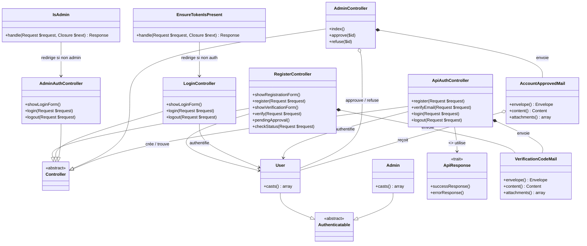

# Diagramme de Classes FINAL — Authentification & Gestion des Comptes
## SmartCoach (Admin · Utilisateur · Visiteur · API)

---

### Liste complète des classes utilisées

| Type | Classe(s) |
|---|---|
| **Structure** | `Authenticatable`, `Controller` |
| **Données (Modèles)** | `User`, `Admin` |
| **Logique (Web)** | `RegisterController`, `LoginController`, `AdminAuthController`, `AdminController` |
| **Logique (API)** | `ApiAuthController`, `ApiResponse` |
| **Sécurité (Middleware)** | `EnsureTokenIsPresent`, `IsAdmin` |
| **Communication (Mail)** | `VerificationCodeMail`, `AccountApprovedMail` |
